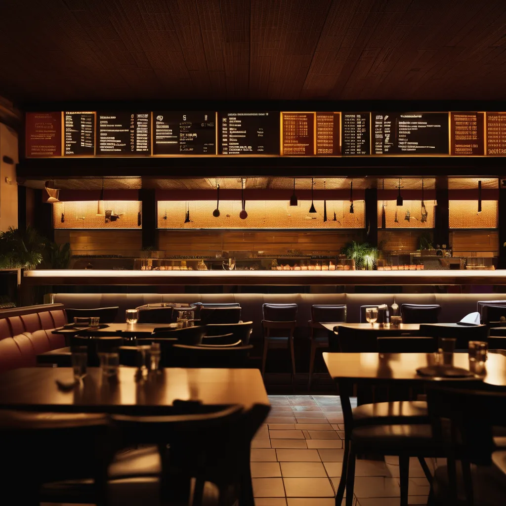
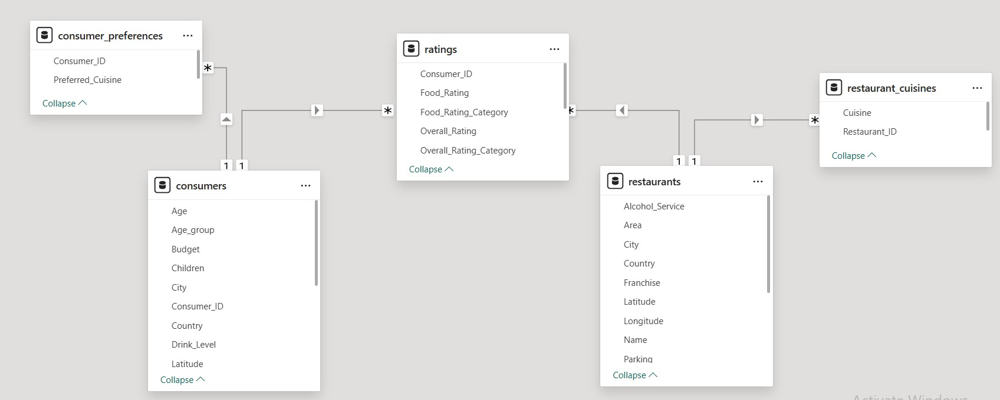
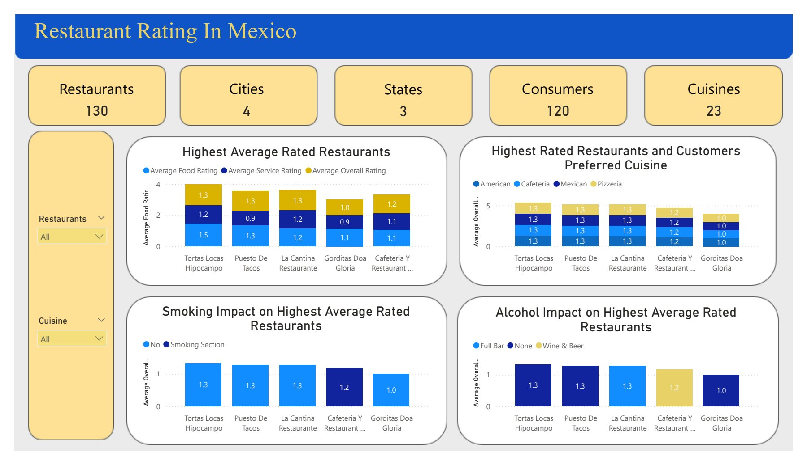
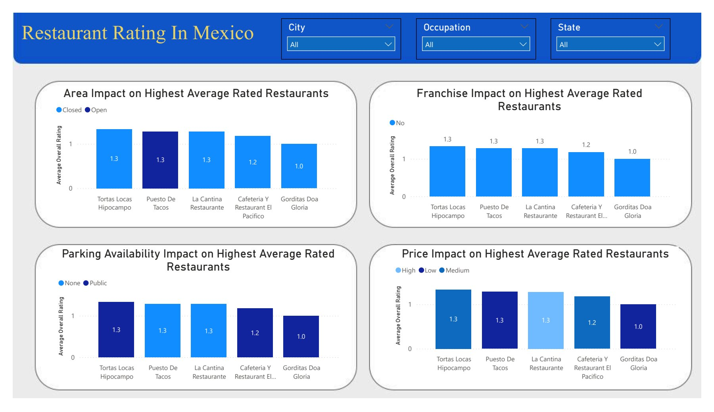
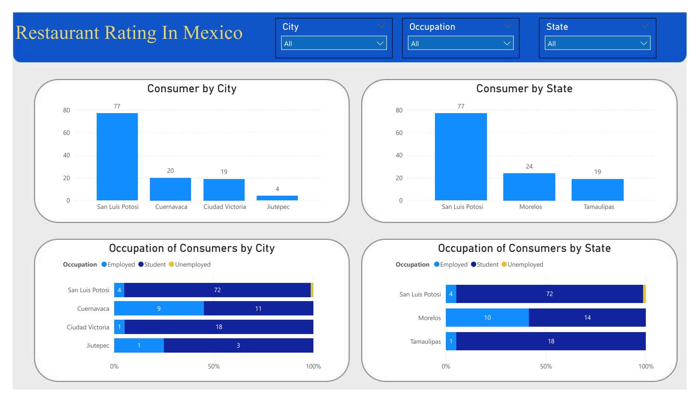
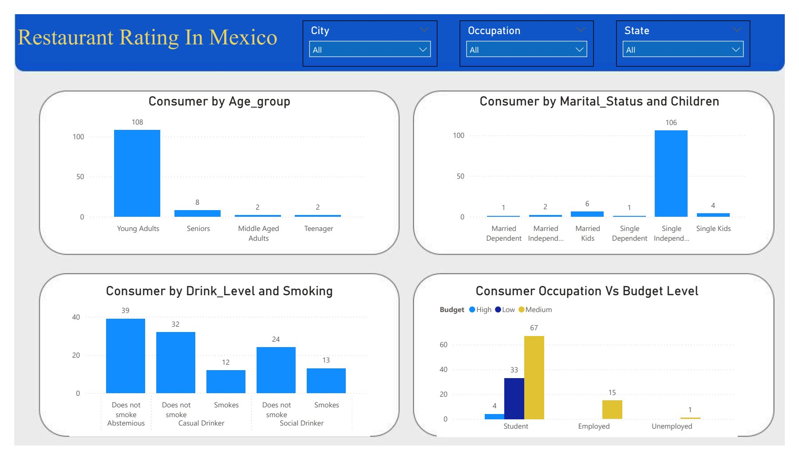

# Restaurant-Rating-In-Mexico

## Introduction

This dataset contains ratings of restaurants in Mexico by customers from 2012. It includes additional information about each restaurant, their cuisines, information about their consumers and the preferences of the consumers.

## Power BI Concepts applied:
- DAX
- Calculated Column
- Filters
- Data Modelling
  
## Problem Statement
1. What can you learn from the highest rated restaurants? Do consumer preferences have an effect on ratings?
2. What are the consumer demographics? Does this indicate a bias in the data sample?
3. Are there any demand & supply gaps that you can exploit in the market?
4. If you were to invest in a restaurant, which characteristics would you be looking for?
   
## Data Cleaning
- I cleaned this dataset using Power Query in Power BI.
- In the ratings table, I added some new columns using conditional columns. I did this to categorize the ratings. "Food_Rating_Category", each if [Food_Rating] = 0 then "Unsatisfactory" else if [Food_Rating] = 1 then "Satisfactory" else "Highly Satisfactory"). I also did it for service and overall rating too.
- In the consumer_preferences table, I made the first row the header
- In the consumers’ table, I filtered out all the null values then changed the ‘Smoker’ column values from Yes/No to Smokes/Does not smoke to make my visualization easier to read.

## Data Modelling

Power BI automatically connected the related tables resulting in a star schema model. 

## Data Analysis
### 1. Highest Rated Restaurants:

- The highest average restaurants include Tortas Locas Hipocampos, Puesto De Tacos, La Cantina Restaurante, Gorditas Doa Gloria and Cafeteria Y Restaurant El Pacifico.
- Yes, Consumer Preferences have an effect on the highest rated restaurants. The top 5 most preferred cuisines are American, Mexican, Cafeteria and Pizzeria.
- The highest rated restaurants mostly had no smoking section, only the fourth rated had a smoking section.
- Three out of the top five most rated restaurants had no alcohol service. So, most consumers preferred consumers without alcohol service and smoke section.
- Most of the top rated restaurants had a closed area.
- None of the top rated restaurants had a franchise.
- Most of the top rated restaurants have a public parking space and no valet parking.
- Most of the top rated restaurants had medium/low pricing.
  
### 2. Demographics:

- The Consumers are located in four cities and three states. The cities include San Luis Potosi, Cuernavaca, Ciudad Victoria and Jiutepec. The states are San Luis Potosi, Morelos and Tamaulipas.
- In San Luis Potosí, 93% of the population consists of students,5.19% consists of employed and 1.3% consists of unemployed. In Morelos, the population also consists of more students- 58.33% and 41.67% of employed. In Tamaulipas, 94.74% of the population are students, while the remaining 5.26% are employed.
- The bulk of the population consists of young adult, single individuals with independent kids.
- Out of the 120 population of the consumers, 39 are abstemious, 44 are casual drinkers and 37 are social drinkers. Also, 95 does not smoke.

## 3. Insights: 
- A restaurant that is located close to a school, making fast foods.
- A restaurant that can double down as a workstation during the day, it will have no smoking section, alcohol only in the evenings, coffee in the morning to serve students and remote workers.
## 4. Investment:
- I will look out for restaurants located around schools as most consumers were students.
- I will also ensure there is Mexican and American cuisine
- I will avoid restaurants with smoking sections, franchise and open areas

